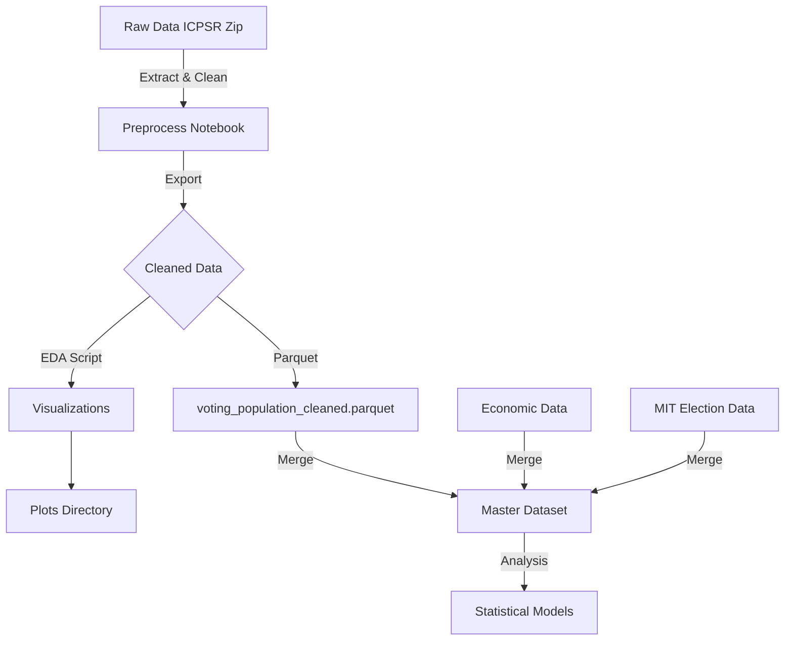

# Stats Final Project: Voting & Economic Analysis

This project investigates the relationship between economic indicators (unemployment, income) and voter turnout/partisan shifts in U.S. counties from 2000 to 2022.

## Project Structure

```
├── data/
- [x] **FIPS Standardization:** Extracted and formatted State/County FIPS codes for merging.
- [x] **Data Export:** Saved cleaned dataset as optimized Parquet file (`voting_population_cleaned.parquet`).

### ✅ Milestone 2: Exploratory Data Analysis (Completed)
- [x] **Visualizations:** Generated trend lines for voter turnout and partisan index (2000-2022).
- [x] **Correlations:** Analyzed relationships between registration, turnout, and partisan lean.
- [x] **Quality Check:** Verified data consistency and identified outlier counties.

### 📅 Milestone 3: Data Merging (Next Step)
- [ ] **Economic Data:** Merge with USDA Unemployment and Income datasets.
- [ ] **Election Data:** Merge with MIT Election Lab presidential returns.
- [ ] **Master Dataset:** Create final `master_analysis.parquet` for modeling.

### 📅 Milestone 4: Statistical Modeling
- [ ] **Regression Analysis:** Fixed Effects models to estimate impact of economic downturns on turnout.
- [ ] **Hypothesis Testing:** Test if economic distress shifts partisan preference.
- [ ] **Final Report:** Summarize findings in Quarto/PDF format.

## Usage
1. **Setup:** Ensure `data/raw` contains the source zip file.
2. **Preprocess:** Run `notebooks/Preprocess_VotingPop.ipynb` to generate cleaned data.
## Data Pipeline Workflow

